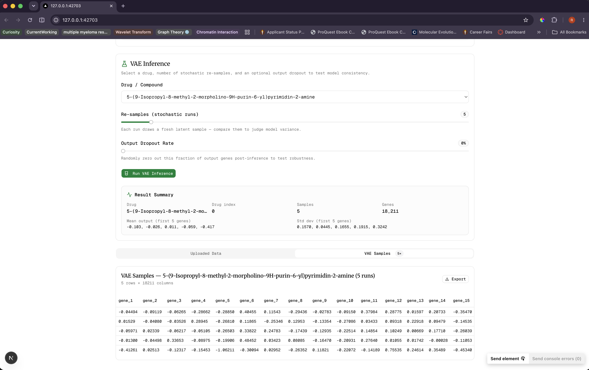
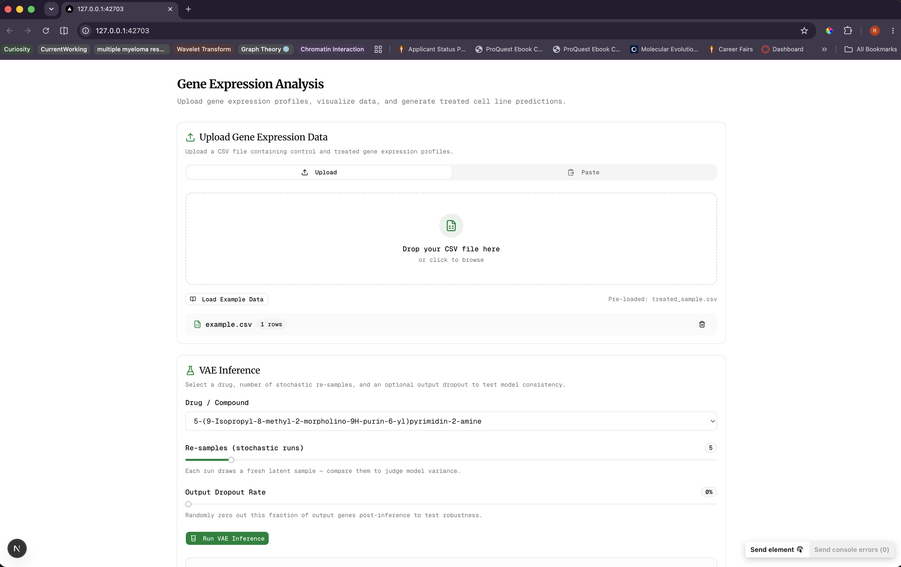

# Perturbation of Single-Cell Gene Expression

A personal challenge to design a perturbation pipeline and data analysis,
End-to-end pipeline for predicting post-treatment gene expression from control cells + drug identity. Built on the NeurIPS 2023 Single-Cell Perturbation dataset.

**Stack:** Python, DuckDB, PyTorch, FastAPI, Next.js, TypeScript

## What's Inside

- **Preprocessing** — DuckDB ETL, CSV → paired train data
- **VAE** — Conditional variational autoencoder with train/val/test splits, checkpointing, and metric dashboards
- **BERT experiment** — Transformer attempt
- **API** — FastAPI backend for inference
- **UI** — Next.js frontend with shadcn/ui for CSV upload and visualization

## Screenshots

**VAE Training Dashboard**

**BERT Training Attempt**

## License

MIT
